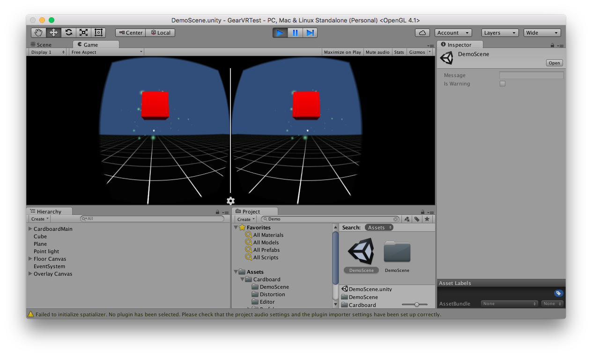

# Unity Gear VR

Simple Project for Gear VR, CardBoard, etc.


## Prerequires

1. Git 2.6+
2. Unity 5+


## How to Play

Clone

```
git clone https://github.com/humbertodias/unity-gear-vr.git
```

Run

Open project with Unity and play the **DemoScene.scene** 

### PrintScreen


[GamePlay](doc/demoscene.mp4)


## References

[CardBoard Unity](https://github.com/tparisi/LearningVirtualReality/tree/master/cardboard-unity)

[Getting Started With Virtual Reality](http://makezine.com/projects/getting-started-with-virtual-reality-building-for-google-cardboard/)


